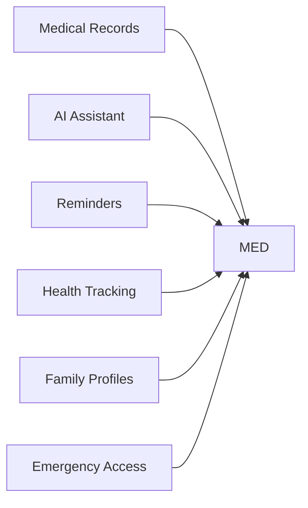

<div align="center">

# 🏥 MED — Medical Vault


<p>
  
  
  
  
</p>

</div>

---

# 🚀 About MED

MED is a modern healthcare management platform designed to provide a beautiful, secure, and intelligent experience for managing medical information.

Built using modern web technologies with a glassmorphism-inspired interface, MED focuses on privacy, simplicity, and accessibility.

---

# ✨ Features

<div align="center">

| Feature | Status |
|----------|----------|
| 🔒 Secure Medical Storage | ✅ |
| 🤖 AI Health Assistant | ✅ |
| 💊 Medicine Management | ✅ |
| ⏰ Smart Reminders | ✅ |
| 👨‍👩‍👧 Family Profiles | ✅ |
| 📊 Health Tracking | ✅ |
| 🌙 Dark Mode | ✅ |
| 📱 Mobile Friendly | ✅ |
| 🚑 Emergency Access | ✅ |
| 🔄 Future Ready Architecture | ✅ |

</div>

---

# 🎯 Live Websites

### 🌐 Main Website
https://omkareshwar18.free.nf

### 🌐 Alternate Website
https://omprime18.web1337.net

### 📧 Email
omkareshwarsinha6@gmail.com

---

# ⚡ Tech Stack

<div align="center">


</div>

```txt
Frontend
├── HTML5
├── CSS3
└── JavaScript

UI
├── Glassmorphism
├── Responsive Design
├── Modern Animations
└── Mobile First

Architecture
├── Modular
├── Scalable
├── Maintainable
└── Future Proof
```

---

# 📈 Project Stats

<div align="center">


</div>

---

# 🌟 Why MED?



MED combines healthcare tools into one seamless platform while keeping the system flexible for future upgrades.

---

# 🛡️ Privacy First

```txt
✔ Local First
✔ Secure Storage
✔ User Controlled
✔ Minimal Dependencies
✔ Privacy Focused
```

---

# 🔥 Future Vision

MED is designed to grow.

Possible future additions include:

- Advanced AI Features
- OCR Scanning
- Medicine Inventory
- Health Analytics
- Smart Reports
- Cloud Sync
- Wearable Integration
- Telemedicine Tools
- Custom Extensions

No README changes required when new modules are added.

---

# 👨‍💻 Developer

<div align="center">

## Omkareshwar Sinha

🌐 Website:
https://omkareshwar18.free.nf

🌐 Alternate:
https://omprime18.web1337.net

📧 Email:
omkareshwarsinha6@gmail.com

</div>

---

# 📊 Visitor Counter

<div align="center">


</div>

---

# ⭐ Support

If you like this project:

```txt
⭐ Star the repository
🍴 Fork it
🚀 Share it
💡 Suggest ideas
❤️ Support development
```

---

<div align="center">


### ❤️ MED — Smarter Healthcare Starts Here

</div>
